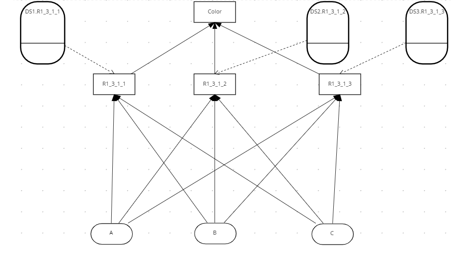

#  DMN Large rules demo

## Description

Example DMN showing how to organise and execute a large number of rules from a hierachical spreadsheet.

The rule spreadsheet is here [Rule spreasheet](docs/HierarchicalRules.xlsx)

The large decision table in R1.3.1.01 is generated from [Java Rule table generator](src/main/java/XMLGenerator.java)

## Top level DMN

<p align="Left"></p>


## Edit and view project

* Open and view the project in VSC using the DMN plugin

### Installing and Running

You will need:

* Java 11+ installed
* Environment variable JAVA_HOME set accordingly
* Maven 3.5.2+ installed

#### Compile and Run in Local Dev Mode

```sh
mvn clean compile quarkus:dev
```

## API

```sh
http://localhost:8080/q/swagger-ui/#/R%201_463_461%20Resource/post_R1_3_1
```

## Test Payload

```sh
{
  "A": "Red",
  "B": "Green",
  "C": "Green"
}
```